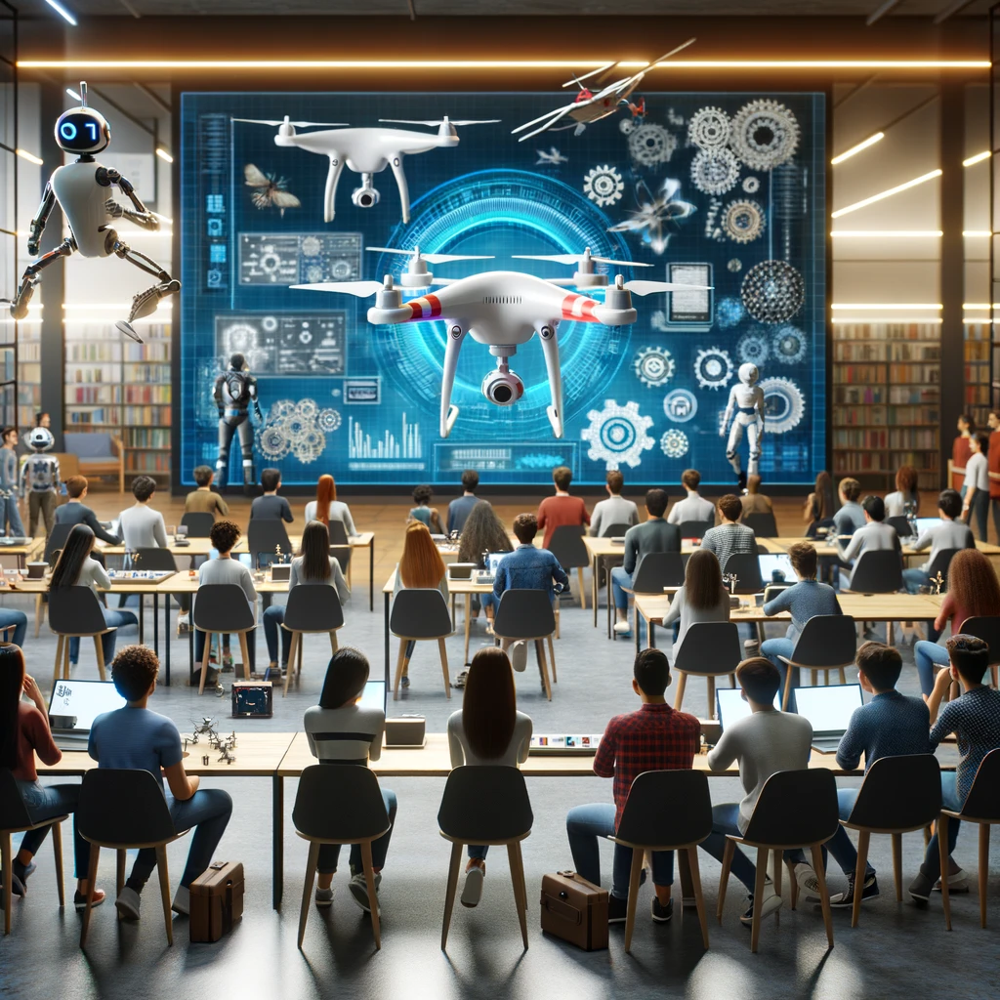

# Partie 2 : Technologie des drones

## Présentation
Ce volet offre une introduction aux bases de la technologie des drones

## Objectifs
- Fournir un aperçu général de la technologie des drones ;

## Programme

### Partie 0 : Principes de base de la technologie des drones
- **Drone** :
  - **Définition** : [https://fr.wikipedia.org/wiki/Drone](https://fr.wikipedia.org/wiki/Drone)
  - **Types** :
    - **Drones multirotors** : [https://en.wikipedia.org/wiki/Multirotor](https://en.wikipedia.org/wiki/Multirotor)
    - **Drones à ailes fixes** ;
    - **Drones hélicoptères monorotor** ;
    - **Drones hybrides VTOL à voilure fixe** ;
  - **Applications** :
    - **Levés avec Photos Orthographiques** ;
    - **Inspection Industrielle** ;
    - **Photographie Aérienne** ;
    - **Vidéographie Aérienne** ;
    - **Services de Surveillance** ;
- **Drones quadricoptères / quadrirotors** :
  - **Définition** : [Description 1](#)
  - **Principe de fonctionnement** : [https://www.dronetechplanet.com/physics-behind-how-drones-fly/](https://www.dronetechplanet.com/physics-behind-how-drones-fly/)
  - **Pièces du quadricoptère et leurs fonctions** :
    - **Quatre hélices** ;
    - **Quatre moteurs BLDC sans balais** ;
    - **Quatre contrôleurs de vitesse électroniques (ESC)** ;
    - **Châssis de drone quadrirotors** ;
    - **Train d'atterrissage** ;
    - **Carte de distribution d'énergie pour drone quadricoptère** ;
    - **Contrôleur de vol** ;
    - **Émetteur et récepteur** ;
    - **Batterie au lithium polymère (LiPo) & chargeur** ;
    - **GPS Module & Laser** ;
    - **Capteurs de bord (e.g. Camera Infrarouge)** ;
  - **Autonomie de la batterie et temps de vol du quadricoptère** :
    - **Autonomie d'une batterie LiPo** ;
    - **Temps de vol du quadricoptère muni d'une LiPo** ;
  - **En savoir plus** : [dronelife.com](dronelife.com)
  - **Simulation / Virtualisation** :
    - **Drone Demo by OSRF** : [https://github.com/osrf/drone_demo](https://github.com/osrf/drone_demo)
    - **DroneViz** : [https://jderobot.github.io/projects/robots_programming_tools/](https://jderobot.github.io/projects/robots_programming_tools/)

### Partie 1 : Drones autonomes ou véhicules aériens sans pilote
- **Système aérien sans pilote (UAS)** :
  - **Définition** : [Description 1](#)
  - **Composition** :
    - **Véhicule aérien sans pilote (UAV)** : [Description 1](#)
    - **Contrôleur au sol ou Remote Ground-based control system (GSC)** : [Description 2](#)
    - **Système de Communication (lie l'UAV à Système de contrôle** : [Description 3](#)
  - **Nécéssité** :
    - **Niveau d'Autonomie** : [Description 1](#)
    - **Applications** : [Description 2](#)
    - **Considérations réglementaires** : [Description 3](#)
