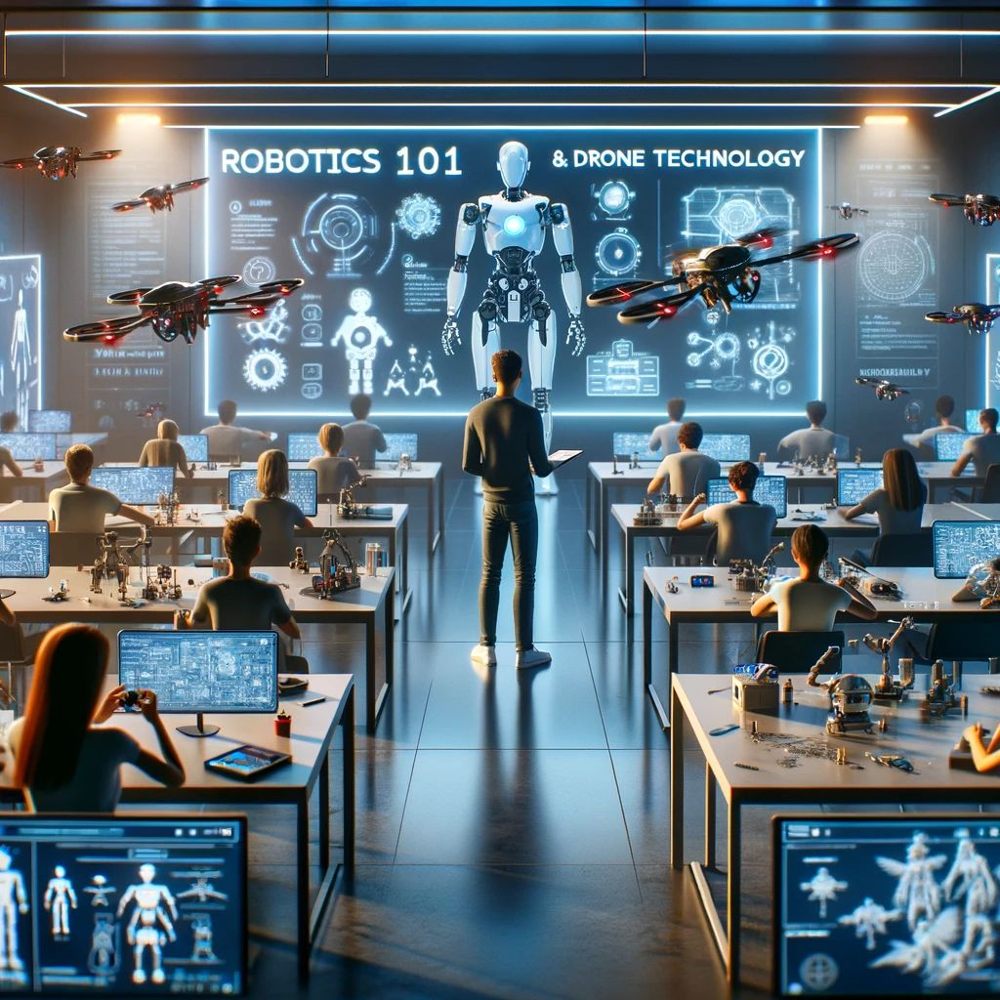

# Robotics 101 & Drone Technology

## Présentation
Cette session gratuite offre une introduction aux **fondamentaux de la robotique** et de la **technologie des drones**, ainsi qu'à la manière dont l'**intelligence artificielle (IA)** appliquée à ces domaines révolutionne notre monde. Initialement prévue pour le DevFest Conakry 2023, elle est organisée par Monsieur [**Francois Gonothi Toure**](https://www.facebook.com/gtfrans2reExIn) en collaboration avec [**FATA.School**](https://fata.school) et avec le soutien de **Keyce Academy** ([**Université Française de Guinée - UFG**](https://ufg.education)). Elle offre une opportunité unique de découvrir les dernières tendances et applications dans ces domaines en rapide évolution.

## Objectifs
- Fournir un aperçu général de la **robotique** et de la **technologie des drones**.
- Explorer l'**application** de l'**intelligence artificielle** dans ces domaines.
- **Démonstration pratique** avec des **outils** et **plateformes en ligne**.

## Prérequis pour les Participants
- Disposer d'un 𝗼𝗿𝗱𝗶𝗻𝗮𝘁𝗲𝘂𝗿 𝗽𝗼𝗿𝘁𝗮𝗯𝗹𝗲 avec une 𝗰𝗼𝗻𝗻𝗲𝘅𝗶𝗼𝗻 𝗶𝗻𝘁𝗲𝗿𝗻𝗲𝘁 pour réaliser des simulations en temps réel pendant la session.
- Avoir des connaissances de base en 𝗲́𝗹𝗲𝗰𝘁𝗿𝗼𝗻𝗶𝗾𝘂𝗲, en utilisation de 𝗟𝗶𝗻𝘂𝘅, et en programmation (𝗣𝘆𝘁𝗵𝗼𝗻 ou 𝗖++).
- Avoir un 𝗰𝗼𝗺𝗽𝘁𝗲 𝗚𝗶𝘁𝗛𝘂𝗯 et connaître les 𝗰𝗼𝗺𝗺𝗮𝗻𝗱𝗲𝘀 𝗱𝗲 𝗯𝗮𝘀𝗲 𝗱𝗲 𝗚𝗶𝘁.

## Inscription

  
Pour participer, veuillez vous inscrire via le <strong>lien</strong> suivant : <a href="https://lnkd.in/eTTTdq-6"><strong>Inscription</strong></a> ou

  scanner le <strong>Code QR</strong> ci-dessous.
   
   
  

## Programme

### Partie 0 : Prérequis
- **Mathématiques** :
  - **Calculus** :
    - **Calculus 1** : [https://www.khanacademy.org/math/calculus-1](https://www.khanacademy.org/math/calculus-1)
    - **Calculus 2** : [https://www.khanacademy.org/math/calculus-2](https://www.khanacademy.org/math/calculus-2) 
  - **Algèbre linéaire** : [https://www.khanacademy.org/math/linear-algebra](https://www.khanacademy.org/math/linear-algebra)
  - **Statistiques & Probabilité** : [https://www.khanacademy.org/math/statistics-probability](https://www.khanacademy.org/math/statistics-probability)
 
- **Langages de programmation** :
  - **C** : [https://www.programiz.com/c-programming](https://www.programiz.com/c-programming)
  - **C++** : [https://www.programiz.com/cpp-programming](https://www.programiz.com/cpp-programming)
  - **Python** : [https://www.kaggle.com/learn](https://www.kaggle.com/learn)
  - **SQL** : [https://www.programiz.com/sql](https://www.programiz.com/sql)
  - **Robot Operating System (ROS)** : [https://drive.google.com/drive/folders/1H48MY7bUYBnqQ-orHN9U2pBoo43jAd8e](https://drive.google.com/drive/folders/1H48MY7bUYBnqQ-orHN9U2pBoo43jAd8e)
 
- **Technologies** :
  - **Linux** : [https://linuxjourney.com/change_locale/fr](https://linuxjourney.com/change_locale/fr)
  - **git/Github** : [https://www.pierre-giraud.com/git-github-apprendre-cours/](https://www.pierre-giraud.com/git-github-apprendre-cours/)
  - **Data Structure & Algorithms** : [https://www.programiz.com/dsa](https://www.programiz.com/dsa)
  - **Problem-Solving** : [https://brilliant.org](https://brilliant.org)
  
### Partie 1: Fondamentaux de la robotique
- **Mécatronique** :
  - **Microcontrôleur** : [Description 1](#)
  - **Capteurs** : [Description 2](#)
  - **Actionneurs** : [Description 3](#)
  - **Modélisation 3D**  : [Description 4](#)
  - **Conception de circuits imprimés** : [Description 5](#)
 
- **Intelligence Machine** :
  - **Traitement des images** : [Description 1](#)
  - **Vision par ordinateur** : [Description 2](#)
  - **Reinforcement Learning** : [Description 3](#)
  - **ML / DL / IA** : [Descrption 4](#)
 
- **Simultaneous Localisation & Mapping (SLAM)** :
  - **Localisation & Mapping** : [Description 1](#)
  - **Planification de chemin & navigation** : [Description 2](#)
  - **Perception et (Re)connaissance** : [Description 3](#)
  - **Contrôle et Actions** : [Description 4](#)
 
- **Mécanique des Robots** :
  - **Transformation des systèmes de coordonnées** : [Description 1](#)
  - **Degré de liberté des robotos** : [Description 2](#)
  - **Cinématique des robots** : [Description 3](#)
  - **Dynamique des robots** [Description 4](#)
 
- **Conception des systèmes de contrôle** :
  - **Contrôle** : [Description 1](#)
  - **Système** : [Description 2](#)
  - **Système de contrôle** : [Description 3](#)
 
- **Cycle de vie du développement de logiciels** :
  - **Définition des besoins** : [Description 1](#)
  - **Architecture logicielle** : [Description 2](#)
  - **Contrôle de version (logicielle)** : [Description 3](#)
  - **Développment agile de logiciels** : [Description 4](#)
 
- **Challenge** : Conception d'un robot qui résout un problème existant en Guinée.

### Partie 2: Technologie des drones
- **Principes de base de la technologie des drones** :
  - **Drone** :
    - **Définition** : [Description 1](#)
    - **Types** : [Description 2](#)
    - **Domaines d'application** : [Description 3](#)
    - **Pilotage de drone : règles et réglementations** : [Description 4](#)
  - **Drones quadricoptères / quadrirotors** :
    - **Définition** : [Description 1](#)
    - **Principes de fonctionnement** : [Description 2](#)
    - **Pièces du quadricoptère et leur fonction** : [Description 3](#)
    - **Physique derrière le mouvement des drones** : [Description 4](#)
    - **Autonomie de la batterie et temps de vol du drone** : [Description 5](#)
- **Drones autonomes ou véhicules aériens sans pilote** :
  - **Systèmes aériens sans pilote (UAS)** :
    - **Définition** : [Description 1](#)
    - **Compostion** :
      - **Véhicule Aérien sans Pilote (UAV)** : [Description 1](#)
      - **Contrôleur au Sol ou Remote Ground Control System (GSC)** : [Description 2](#)
      - **Système de Communication (lien UAV-GSC)** : [Description 3](#)
    - **Nécéssité** :
      - **Niveaux d'Autonomie** : [Description 1](#)
      - **Applications** : [Description 2](#)
      - **Considérations Réglementaires** : [Description 3](#)

### Partie 3: Application de l'IA à la robotique et la technologie des drones
- **Titre 1**: [Description 1](#)
- **Titre 2**: [Description 2](#)
- **Titre 3**: [Description 3](#)
