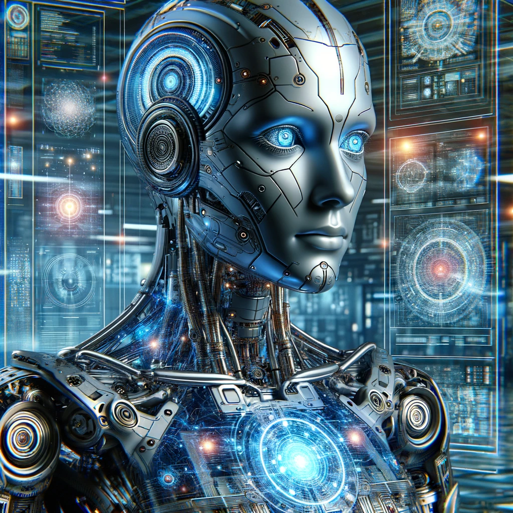

# Partie 1 : Fondamentaux de la robotique

## Présentation
Ce volet offre une introduction aux fondamentaux de la robotique

## Objectif
- Fournir un aperçu général de la robotique ;

## Programme

### Partie 0 : Introduction
- **Robot(ique)** :
  - **Historique** : [Origines du « robot » et de la « robotique »](https://cs.stanford.edu/people/eroberts/courses/soco/projects/1998-99/robotics/history.html#:~:text=Origins%20of%20%22robot%22%20and%20%22robotics%22) ;
  - **Définition** : [Définitions de « robot »](https://cs.stanford.edu/people/eroberts/courses/soco/projects/1998-99/robotics/history.html#:~:text=Definitions%20of%20%22robot%22) ;
  - **Loi d'Assimov** : [Les lois de la robotique](https://cs.stanford.edu/people/eroberts/courses/soco/projects/1998-99/robotics/history.html#:~:text=Asimov%20also%20proposed%20three%20%22Laws%20of%20Robotics%22%20that%20his%20robots%2C%20as%20well%20as%20sci%2Dfi%20robotic%20characters%20of%20many%20other%20stories%2C%20followed%3A) ;
  - **Robotique Responsable** : [https://responsiblerobotics.eu](https://responsiblerobotics.eu) ;
  - **Le robot idéal** : [Dix principales capacités d’un robot idéal](https://cs.stanford.edu/people/eroberts/courses/soco/projects/1998-99/robotics/) ;
 
- **Anatomie des robots** :
  - **Anatomie d'un robot** : [https://motion.cs.illinois.edu/RoboticSystems/AnatomyOfARobot.html](https://motion.cs.illinois.edu/RoboticSystems/AnatomyOfARobot.html) ;
  - **Anatomie des robots : hardware** :
    - **Unité Centrale de Traitement (CPU)**: Le cerveau du robot, responsable du traitement des instructions, de la prise de décisions et de l'exécution des commandes.
    - **Capteurs**: Ce sont les équivalents des sens humains pour un robot. Ils comprennent des caméras (vision), des microphones (ouïe) et divers capteurs environnementaux pour détecter la température, la proximité et la pression.
    - **Actionneurs**: Ils fonctionnent comme des muscles, permettant au robot de se mouvoir. Cela inclut des moteurs pour le mouvement des membres, des roues ou d'autres parties.
    - **Alimentation**: C'est la source d'énergie du robot, souvent des batteries ou des cellules d'énergie, qui doivent être régulièrement rechargées ou remplacées.
    - **Stockage de Mémoire**: Semblable à la capacité humaine de se souvenir, cela stocke les données et instructions nécessaires au fonctionnement du robot.
    - **Interfaces d'Entrée/Sortie**: Elles sont utilisées pour communiquer avec d'autres appareils ou systèmes, comme des ports USB, des modules de communication sans fil (comme le Wi-Fi ou le Bluetooth), et parfois des interfaces spécialisées pour des tâches spécifiques.
    - **Carte Mère**: Le centre de connexion où tous les autres composants sont reliés, leur permettant de communiquer entre eux.
    - **Effecteurs Finaux**: Ce sont les outils ou dispositifs situés à l'extrémité d'un bras robotique, tels que des pinces, des caméras ou des outils spécialisés pour des tâches comme le soudage ou la peinture.
    - **Système de Navigation**: Cela inclut le GPS et d'autres technologies pour aider le robot à comprendre sa position et à se déplacer.
    - **Systèmes de Refroidissement**: Pour éviter la surchauffe, surtout dans les robots qui effectuent des tâches de haute intensité ou qui fonctionnent dans des environnements chauds.
    - **Boîtier de Protection et Structure**: La structure qui maintient tous les composants ensemble et les protège des facteurs environnementaux.
    - **Logiciel et Firmware**: Cela inclut le système d'exploitation et le logiciel qui fonctionne sur le matériel, contrôlant les actions et les réponses du robot.
  - **Anatomie des robots : Software** : 
    - **Système d'exploitation (OS) :**
      - Logiciel principal qui gère les ressources matérielles du robot.
      - Fournit des services communs pour d'autres logiciels.
      - Crucial pour coordonner les tâches et gérer les ressources efficacement.
  
    - **Logiciel de système de contrôle :**
        - Responsable de l'interprétation des commandes et de leur traduction en actions.
        - Comprend des algorithmes pour le contrôle des mouvements, la gestion des capteurs et des actionneurs.
        - Assure que le robot peut se déplacer et fonctionner comme prévu.
    
    - **Logiciel de navigation et de cartographie :**
        - Aide les robots mobiles à comprendre et à naviguer dans leur environnement.
        - Inclut des algorithmes pour la planification de trajets et l'évitement d'obstacles.
        - Peut impliquer la localisation et la cartographie simultanées (SLAM).
    
    - **Logiciel de fusion de capteurs :**
        - Intègre les données de différentes sources sensorielles.
        - Fournit une compréhension complète des environs.
        - Essentiel pour la détection d'objets et la surveillance de l'environnement.
    
    - **Modules d'intelligence artificielle (IA) et d'apprentissage automatique (ML) :**
        - Utilisés pour des capacités de prise de décision et d'apprentissage avancées.
        - Peuvent inclure des réseaux neuronaux, des arbres de décision et d'autres algorithmes d'IA.
        - Permettent au robot de s'adapter à de nouvelles situations et de prendre des décisions complexes.
    
    - **Logiciel de communication :**
      - Permet au robot de communiquer avec d'autres systèmes, dispositifs ou réseaux.
      - Essentiel pour recevoir des commandes et envoyer des données.
      - Important pour l'intégration à d'autres systèmes dans un environnement intelligent.
    
    - **Logiciel d'interface utilisateur (UI) :**
      - Conçu pour l'interaction homme-robot.
      - Peut inclure des interfaces graphiques, des modules de reconnaissance vocale.
      - Facilite la télécommande et d'autres formes d'interaction.
    
    - **Logiciel de diagnostic et de maintenance :**
      - Aide à surveiller la santé du robot et à diagnostiquer les problèmes.
      - Parfois utilisé pour effectuer des tâches de maintenance automatique.
      - Crucial pour la fonctionnalité et la fiabilité à long terme.
    
    - **Logiciel de sécurité :**
      - Essentiel pour protéger contre les accès non autorisés et les menaces cybernétiques.
      - Important étant donné la connectivité croissante des robots.
    
    - **Logiciel d'application personnalisé :**
      - Dépend de l'objectif spécifique du robot.
      - Conçu pour des tâches particulières comme la fabrication, les procédures médicales ou le service à la clientèle.

  - **Analogy humain-robot** :
    - **La vue :** Chez les humains, la vue est assurée par les yeux qui captent la lumière et permettent de percevoir l'environnement. Dans les robots, cela est souvent simulé par des caméras et des capteurs qui capturent des images, permettant au robot de "voir" et d'analyser son environnement.
    
    - **L'ouïe :** L'ouïe humaine est réalisée par les oreilles qui captent les ondes sonores. Les robots peuvent avoir des microphones qui jouent un rôle similaire, captant les sons pour que le robot puisse répondre ou réagir à des stimuli auditifs.
    
    - **Le toucher :** Les humains ont la peau qui permet de sentir la pression, la texture, et la température. Les robots peuvent avoir des capteurs tactiles qui imitent cette sensation, leur permettant de détecter la pression ou la texture des objets qu'ils manipulent.
    
    - **L'odorat et le goût :** Ces sens sont plus complexes à imiter. Chez les humains, ils sont assurés par le nez et la langue, détectant respectivement des molécules chimiques dans l'air ou dans la nourriture. Certains robots avancés peuvent être équipés de capteurs chimiques pour détecter des substances spécifiques, mais cette technologie est moins développée comparée aux autres sens.

 
- **Types de robots** :
  - **Robots terrestres** : Ce sont des robots conçus pour se déplacer et opérer sur des surfaces terrestres. Les exemples incluent les rovers d'exploration planétaire, les robots de déminage, et les robots de livraison autonomes.
  - **Robots aériens** : Ces robots opèrent dans les airs. Ils comprennent des drones utilisés pour la photographie aérienne, la surveillance, et la livraison de colis.
  - **Robots sous-marins** : Ces robots sont spécialisés pour l'exploration et le travail dans les environnements aquatiques. On y trouve des véhicules autonomes sous-marins (AUV) pour l'étude des fonds marins et des ROV (Remote Operated Vehicles) pour des tâches comme la réparation de pipelines sous-marins.
  - **Bras robotisés** : Ce sont des robots conçus principalement pour la manipulation d'objets. Ils sont couramment utilisés dans la fabrication industrielle pour des tâches comme l'assemblage, la soudure, et la peinture.
 
- **Domaines d'application** :
  - **Industrie manufacturière** : automatisation des lignes de production, soudage, peinture, assemblage de pièces.
  - **Médecine et chirurgie** : robots chirurgicaux pour des opérations précises, assistance en rééducation, robots de dispensation de médicaments.
  - **Exploration spatiale** : rovers pour explorer d'autres planètes, satellites robotisés pour l'observation et la recherche spatiale.
  - **Agriculture** : robots pour la plantation, la récolte, la surveillance des cultures, et la gestion du bétail.
  - **Sécurité et défense** : robots de déminage, drones de surveillance, robots d'intervention tactique.
  - **Logistique et transport** : robots de manutention dans les entrepôts, drones de livraison, véhicules autonomes.
  - **Environnement et océanographie** : robots pour la surveillance environnementale, l'étude des océans, et la collecte de données climatiques.
  - **Assistance personnelle et soins aux personnes âgées** : robots d'assistance à domicile, robots de compagnie, robots d'aide aux personnes à mobilité réduite.
  - **Recherche et éducation** : robots utilisés dans l'enseignement de la robotique et de la technologie, robots pour des expérimentations scientifiques.
  - **Entertainment et médias** : robots animatroniques pour le cinéma et les parcs à thème, drones pour la photographie et la réalisation de films.
  - **Sauvetage et réponse aux urgences** : robots pour les opérations de recherche et de sauvetage dans des environnements dangereux ou inaccessibles.

 
### Partie 1 : Robotique & IoT
- **Cartes de microcontrôleur** :
  - **Arduino** : [Premiers pas avec Arduino](https://docs.arduino.cc/learn/starting-guide/getting-started-arduino)
  - **Microcontrôleurs compatibles Wifi** :
    - **esp32** : [Débuter avec l'ESP32](https://randomnerdtutorials.com/getting-started-with-esp32/)
    - **esp8266** : [ESP8266 pour l'Internet des objets](https://www.nabto.com/esp8266-for-iot-complete-guide/)
  - **Raspberry Pi** : [Documentation Raspberry Pi](https://www.raspberrypi.com/documentation/)
 
- **Composantes physiques** :
  - **Capteurs** ;
  - **Actionneurs** ;
  - **Suppléments** :
    - **LEDs** ;
    - **Buzzers** ;
    - **Autres** ;
  - **Virtualisation & Plateformes** :
    - **Tinkercad** : [https://www.tinkercad.com](https://www.tinkercad.com)
    - **Circuito.io** : [https://www.circuito.io](https://www.circuito.io)
    - **hackster.io** : [https://www.hackster.io](https://www.hackster.io)
  - **Communication** :
    - **Serial** ;
    - **Parallèle** ;
  - **Pins** :
    - **Digital** ;
    - **Analog** ;
   
- **Construction d'un robot** :
  - **Collecte de composants électroniques** ;
  - **Assemblage desdits composants** ;
  - **Mouvements du robot** ;
  - **Codage du robot** ;
  - **Téléversement du code** ;
 
- **Internet des Objets** :
  - **Définition** ;
  - **Microcontrôleur activé par Wifi** ;
  - **Indicator LEDs** ;
  - **Architecture cloud IoT** ;
  - **Connection Microcontrôleur & Cloud** ;
 
### Partie 2 : Fondation du code pour ROS ou Robot Operating System (Système d'Exploitation pour la Robotique)
- **Linux pour ROS** : 
  - **Navigation à travers un système de fichiers Linux** ;
  - **Interagir avec le système de fichiers Linux** ;
  - **Editer des fichiers à l'aide du shell (Emacs/Vi/Vim)** ;
  - **Managing access to files (permissions)** ;
  - **Shell / bash scripting** ;
  - **Gérer les exécutions de programmes Linux (Processes)** ;
  - **Se connecter à l'ordinateur distant d'un robot (ssh)** ;
 
- **Python (3) for ROS** :
  - **Stockage des données dans des variables** ;
  - **Operating with data in the variables** ;
  - **Modifier le comportement en fonction des conditions** ;
  - **Création de fonctions pouvant être appelées depuis d'autres endroits du code** ;
  - **Comment encapsuler le code dans des classes** ;
  - **Avoir un code propre et robuste** ;
 
### Partie 3 : Robotique & Open Source
- **Organisations majeures** :
  - **OSRF (Open Source Robotics Foundation)** : [https://www.openrobotics.org](https://www.openrobotics.org)
  - **JdeRobot** : [https://jderobot.github.io](https://jderobot.github.io)
